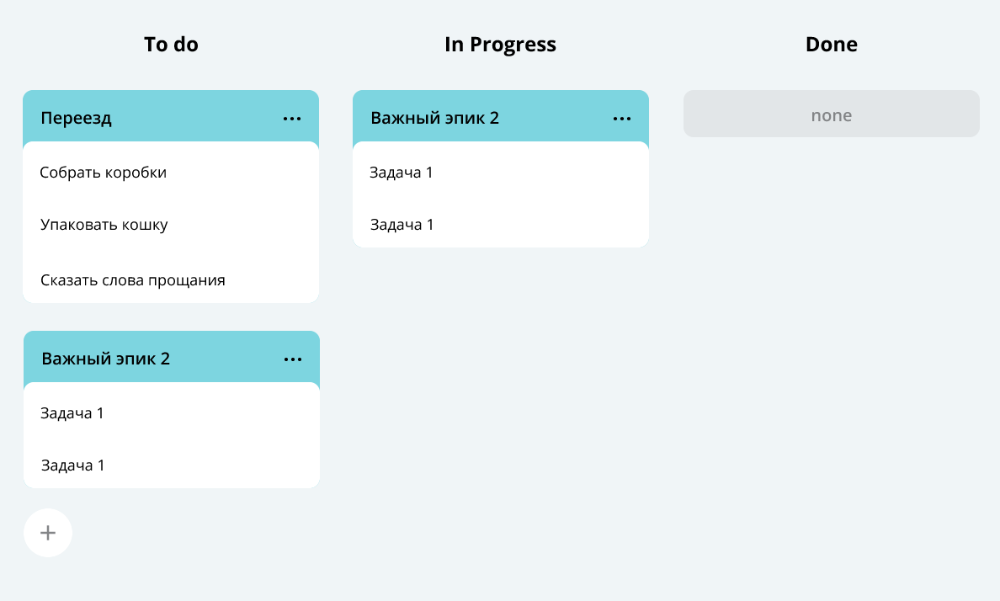

# Трекер задач

### Стек:

- Java 11
- JUnit 5
- GSON

# Описание проекта

REST-приложение для управления задачами. В приложении есть три сущности - обычные задачи, подзадачи и эпики. Эпик - это
составная задача, которая состоит из нескольких подзадач. Обычные задачи выполняются отдельно и не входят в эпики.
В проекте реализованы два сервера, один из которых отвечает за приём HTTP-запросов и отправку ответов, второй - за
сохранение и загрузку данных приложения. Также в приложении есть возможность сохранять данные локально в файл CSV и
написаны JUnit тесты. Серверы реализованы при помощи HttpServer, преобразование JSON-формата в объекты приложения и
обратно -
при помощи библиотеки GSON.

## Функционал приложения

### Эпики

- добавление нового эпика
- обновление эпика
- получение списка подзадач эпика
- получение эпика по ID
- получение списка всех эпиков
- удаление эпика
- удаление всех эпиков

### Подзадачи

- добавление новой подзадачи
- обновление подзадачи
- получение подзадачи по ID
- получение списка всех подзадач
- удаление подзадачи
- удаление всех подзадач

### Задачи

- добавление новой задачи
- обновление задачи
- получение задачи по ID
- получение списка всех задач
- удаление задачи
- удаление всех задач

### История просмотров

- получение истории просмотров задач/подзадач/эпиков

## Запуск приложения

java-kanban/src/main/Main -> "run"

